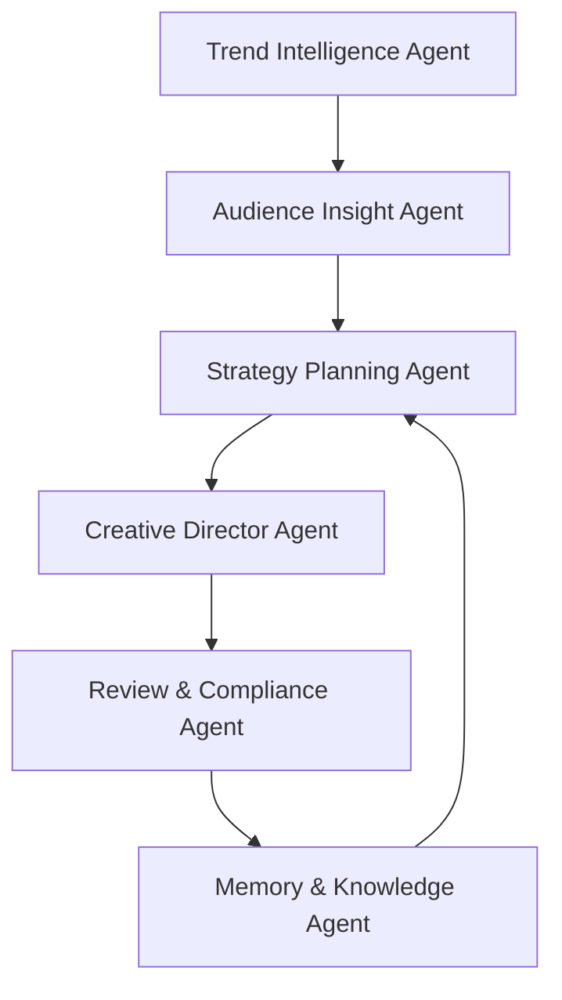

# DeepVision Omni-Agent

Enterprise-grade Multi-Agent Platform for Marketing Intelligence & Content Generation

## Overview

DeepVision Omni-Agent is a high-concurrency Multi-Agent orchestration platform designed for:

- Marketing intelligence
- Brand campaign automation
- Social media trend analysis
- Long-chain reasoning workflows
- Multi-modal content generation
- Enterprise AI collaboration

---

## Core Architecture

The platform adopts a Hierarchical Multi-Agent Architecture.

### Main Agents

- Trend Intelligence Agent
- Audience Insight Agent
- Strategy Planning Agent
- Creative Director Agent
- Review & Compliance Agent
- Memory & Knowledge Agent

---

## Key Features

- Long Context Reasoning
- Multi-Agent Collaboration
- Autonomous Workflow
- Agent Memory System
- RAG-based Retrieval
- Parallel Creative Generation
- Enterprise Content Pipeline

---

## Resource Consumption

Typical enterprise campaign:

- 30~50 creative directions
- 100+ title generations
- Multi-platform adaptation
- Continuous sentiment analysis

Estimated consumption:

- 3M ~ 8M Tokens per project

---

## Tech Stack

- Python
- FastAPI
- LangChain
- LangGraph
- Redis
- PostgreSQL
- FAISS
- Docker

---

## Run

```bash
docker compose up --build
```

---

## System Workflow



---

## Benchmark

Internal benchmark:

- 70% reduction in campaign planning time
- 80% faster trend response
- Multi-platform content generation automation
- Long-context memory persistence support

---

## Future

- Agent Swarm
- Autonomous Scheduling
- Reinforcement Learning Optimization
- Multi-modal Video Reasoning
- Enterprise AI Operating System
